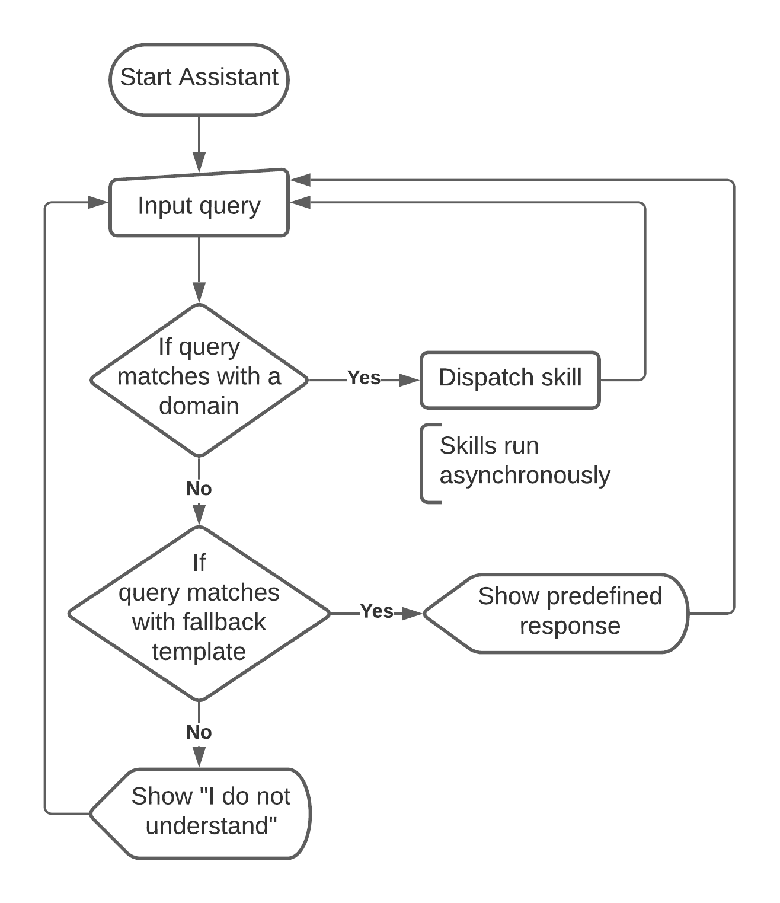

# Maastricht University - Multimodal Digital Assistant
## Project 2-2 Group 9

### Quick Introduction

##### Language & Terminology

* Domain: A 'Domain' is a module responsible for handling a narrow set of queries.  (a calendar domain is responsible for handling queries related to  scheduling tasks). Every domain is also responsible for running skills.
* Skill: A 'Skill' represents an action the assistant can perform (reading the  schedule from MyUM Calendar or reading my notes, etc.). Skills are  essentially simple actions that, together, conform a set of actions that belong to a domain.
* Fallback Skill: A 'Fallback Skill' is a user-defined skill composed of a pattern and a corresponding response. When a query does not match with any domain, then it will try matching with a fallback skill.

##### Why 'multimodal'?

Our design allows multiple skills to run at the same time. In other words, the assistant can be requested to search for a file in the device while trying to perform a google search. This is a stark contrast with single-threaded versions which would require the user to wait longer.

Skills can also produce output messages (text, images, links, etc.) without interrupting back-and-forth interaction.

##### Diagram of  user-assistant interaction

Seeking to elucidate; this loop-like interaction is broken either by closing the window or triggering the 'Leave' domain.

### Documentation & Tutorials

[Pattern Language](./Readmestuff/pattern_lang.pdf)

[Custom Responses](Readmestuff/custom_skills_lang.pdf)

[CFG Models](Readmestuff/CFG_Language.pdf)

[CFG Models](Readmestuff/

[How to build a domain?](./Readmestuff/howto_build_domain.pdf)

#### How to define custom skills?
  1) Write a text file with custom responses such as in [Custom Responses](Readmestuff/custom_skills_lang.pdf)
  2) Run the assistant and drop the text file in "drop file"

The assistant will remember previously defined custom skills, to get rid of them press "clear templates".

### Dependencies:

[OpenCV](https://opencv-java-tutorials.readthedocs.io/en/latest/01-installing-opencv-for-java.html) (OpenCV dependent skills will not run on MacOS for the time being)

### External Resources:

[Windows lnk parser](https://stackoverflow.com/questions/309495/windows-shortcut-lnk-parser-in-java)

[String similarity metric](https://gist.github.com/thotro/af2dcbcf6bd7ecd9f5fc)

### Running For The First Time:
  1) Install OpenCV (On Windows you will just need to invoke the photo skill, other OSs are not yet supported)
  2) Clone this repository
  3) Gradle > Execute Gradle Task > run

### Using Calendar Domain:

  1) For more information use the "help calendar" command or [click here](https://www.youtube.com/watch?v=Gqyd9Ot5a7s)
  2) Go to the student portal
  3) Go to the My Timetable tab
  4) Go to the calendar section and scroll to the bottom
  5) Click "Agenda connect manual" and open "General Timetables"
  6) Click the "Connect calendar" button on the top right of the page (next to the download calendar button)
  7) Click the "other" options
  8) You now can copy the link and use the command "set calendar" to set it up in the application
 
### The Datasets
The datasets used for training and testing the SVM can be found here in this google folder https://drive.google.com/drive/folders/19uIjx2ooVHe4f38JwmGSdULnZAOCvBsR?usp=sharing . To train the model, add the folder 'SVM Data' which is in the link provided and add it to the folder 'assets'. Then you can run the main method found in SVMFunctions.java .

### Adding people to the dataset
Adding people to the dataset making them recognizable from the program is very easy. You will need about 100/150 pictures of your face in different light conditions and moods. To feed the dataset those need to be transformed into 250x250 grayscales images and needed to be added into a specific directory inside the dataset folder. It is very important that there is only one directory per person and that the said directory contains only one person. To help you out with this we created a python code able to "optimize" all images into a specific folder. This script can be found inside ReadMeStuff.
